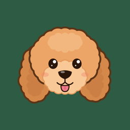
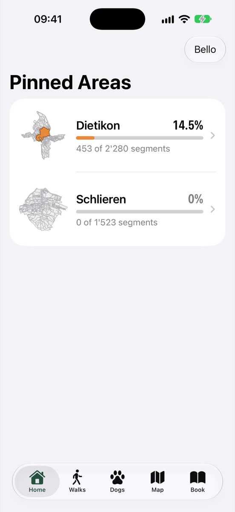
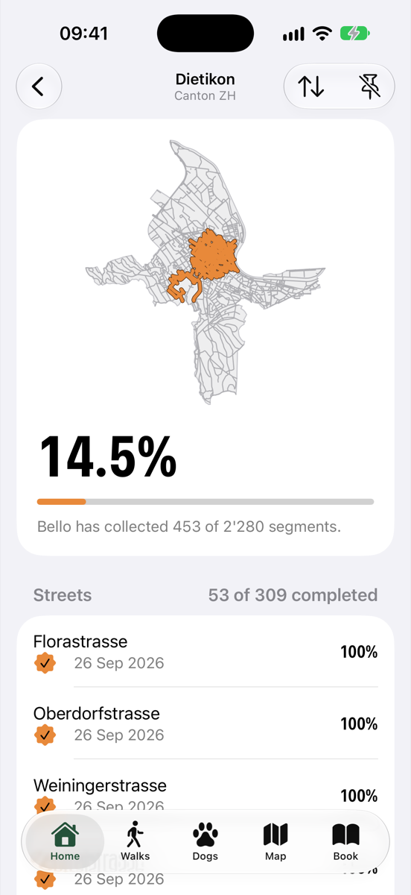
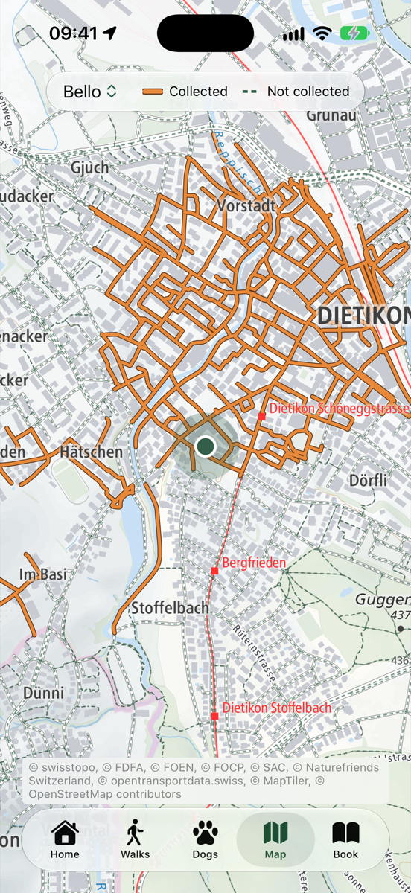
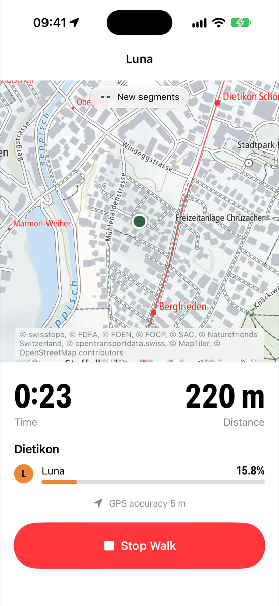
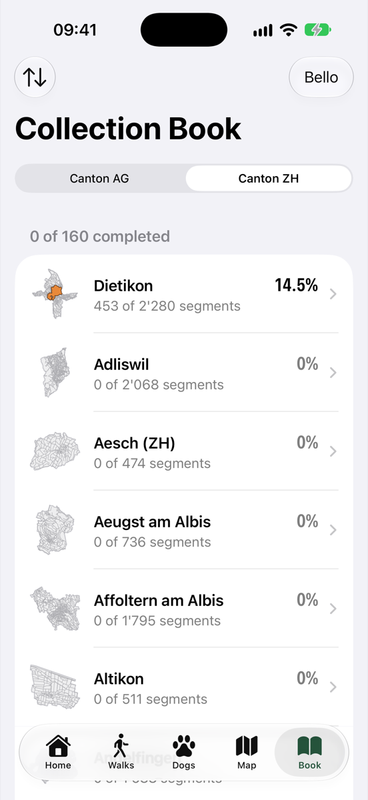
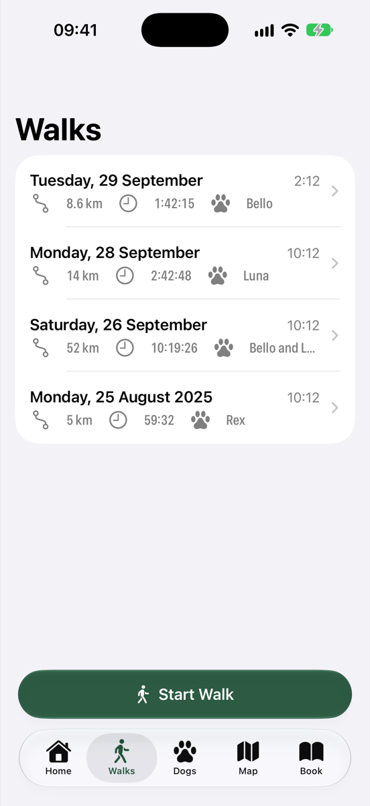

  

<h1 align="center">GassiPass</h1>

  A game for dog walks in Switzerland. 
  Each dog collects the paths and streets it walks, and fills in Gemeinden until they are completed.

  
  
  

  
  
  
  

## How it works

The map of Switzerland is cut into **segments**. A segment is a stretch of walkable way between two junctions. When a dog's walks cover nearly all of a segment, the dog **collects** it. The walks do not need to cover it in one go.

Every Gemeinde is an **area**. The collected length of an area, as a share of its total length, is its **completion**. When the completion reaches 100%, the dog has **completed** the area, and the app keeps that date for good. Streets work the same way inside each area.

Each dog has its own collection. When two dogs go on the same walk, both collect the segments.

## Features

- **Walks.** Start a walk, pick the dogs that take part, and put the phone in your pocket. The app records the track also when the phone is locked.
- **Live feedback.** During the walk, the map shows the new segments near you. The phone vibrates for each segment that becomes collected, and the completion of the current area goes up live. A Live Activity shows the walk on the lock screen.
- **Pinned areas.** Pin the areas you want to follow, and see their completion on the home screen.
- **Area screen.** See the collected segments of an area on its map, and the completion of each street.
- **Collection book.** Browse all areas of a canton for one dog, including the areas it has not visited yet.
- **Map.** See the collected and the not collected segments on the swisstopo base map.
- **Several dogs.** Each dog has its own collection. A retired dog keeps its collection and its completed areas.
- **Map packages in the app.** The segments, the areas and the segment tiles of each canton come with the app, so a walk counts also without a network.

  
  

## Map data

The segments come from [swissTLM3D](https://www.swisstopo.admin.ch/en/landscape-model-swisstlm3d), the landscape model of swisstopo, and the areas come from [swissBOUNDARIES3D](https://www.swisstopo.admin.ch/en/landscape-model-swissboundaries3d). The app does not use OpenStreetMap for segments. [ADR 0001](docs/adr/0001-swisstlm3d-as-segment-source.md) explains why.

Ways that a dog cannot or must not use are not segments. Examples are motorways, via ferratas, alpine routes and ways inside a dog-ban zone.

At the moment the app includes canton Zürich and canton Aargau.

## Build the app

You need Xcode 26 and a device or simulator with iOS 26.

1. Open `gassipass.xcodeproj` in Xcode.
2. Select the scheme `gassipass` and run it.

The map packages of the cantons are in `gassipass/MapPackages/`, so the app runs without the map build. To make the packages again from the swisstopo data, see [mapbuild/README.md](mapbuild/README.md).

To see the app with sample dogs and walks in Dietikon, add the launch argument `-demoData YES` in a debug build. The app then keeps its store in memory and does not touch your real walks.

## Tests

- The app tests run with the scheme `gassipass` (⌘U in Xcode).
- The map build tests run with `make test` in `mapbuild/`.
- The scheme `gassipass Screenshots` saves a screenshot of each main screen with the demo data. See `gassipassUITests/ScreenshotTests.swift`.

## Project layout

| Folder | Content |
| ------ | ------- |
| `gassipass/` | The iOS app (SwiftUI, SwiftData, MapLibre) |
| `gassipassWidgets/` | The Live Activity of the current walk |
| `gassipassTests/` | The unit tests and the engine tests |
| `mapbuild/` | The Python tool that makes the map packages from swisstopo data |
| `brand/` | The script that draws the app icon and the launch image |
| `docs/adr/` | The architecture decisions |

The words of the domain, such as segment, area, collection and completion, are defined in [CONTEXT.md](CONTEXT.md).

## Attribution

Segment and area data ©swisstopo. The base map is the swisstopo light base map, with the attributions that the app shows on each map.

## License

Copyright © 2026 Maximilian Walterskirchen. All rights reserved.

The source code is public so that people can read it. It has no open-source license. You may not copy, change or distribute it without written permission.

The swisstopo data in the map packages is not covered by this notice. It stays under the [terms of use of swisstopo](https://www.swisstopo.admin.ch/en/terms-of-use-free-geodata-and-geoservices), which require the attribution "©swisstopo".
